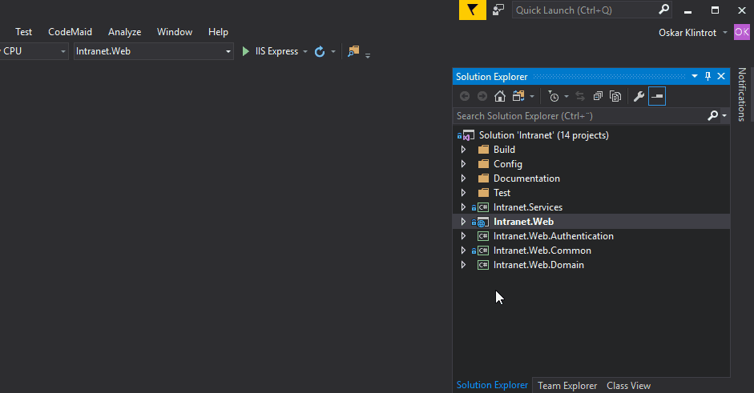

# First Setup

Prerequisites:
 - dotnet core 2.0 SDK
 - Node (v6 LTS will work just fine)
 - SQL Express LocalDB (might not be necessary if you have VS installed)
 - Visual Studio 2017 (or your favorite IDE/text editor with C# support)

Steps:
 1. Start Powershell in Admin mode and set Execution Policy to `RemoteSigned`:
 
    ```Powershell
    > Set-ExecutionPolicy -ExecutionPolicy RemoteSigned
    ```
 2. Run the build script:
     ```Powershell
    > .\src\build.ps1
    ```
 3. Set all user secrets either with `dotnet user-secrets set` or from Visual Studio:
 
    
 4. Go to `/src/Intranet.Web`.
 5. Start the application:
    ```Powershell
    > dotnet run
    ```
